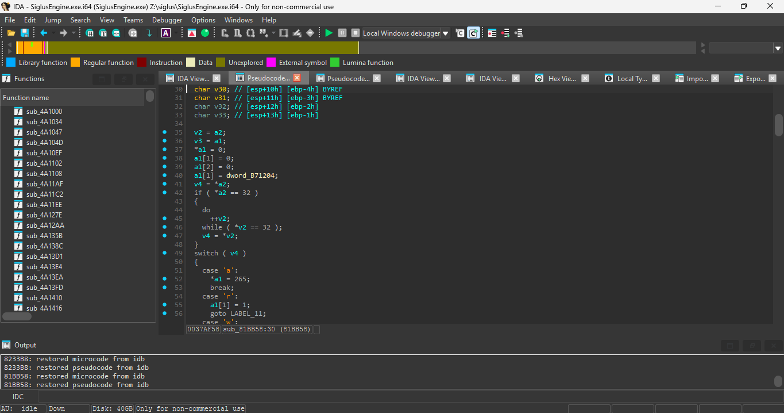

# Practica 1

## Instalación:
- Usando scoop (una herramineta para instalar programas a nivel usuario) se instala JDK (seleccione Temurin LTS)
~~~
scoop install temurin-lts-jdk
~~~

- Usando scoop se instala IDEA Ultimate (Gratis para estudiantes)
~~~
scoop install temurin-lts-jdk
~~~

## Elemento de Decisión Propia
Es un codigo bastante sencillo (en Java, en otros lenguajes es tedioso porque no usand UTF-16), basicamente toma un
valor numerico y lo representa como un caracter, es util porque eh estado experimentando con
ingenieria inversa y recientemente me tope con esto:

En realidad ese 32 deberia ser un " ", pero IDA no sabe que a2 es caracter y por lo tanto no sabe como interpretarlo,
esto hace confuso el pseudo-C.

En realidad lo mas confuso es que inluso si te das cuenta de que representa un caracter, no es facil conocer de memoria
que represeta. Este codigo lo simplifica