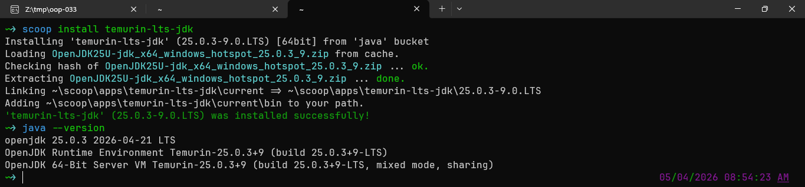
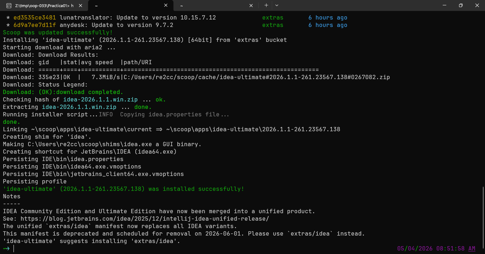
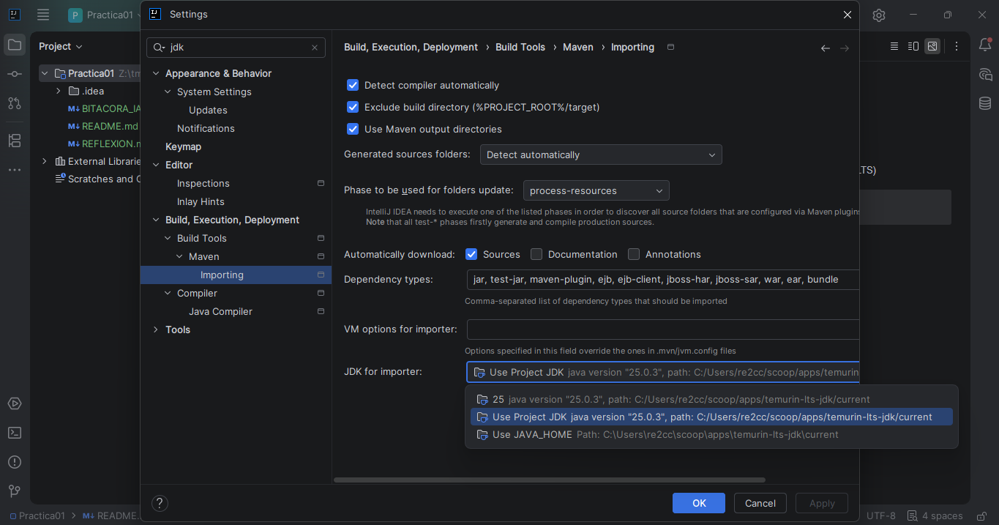

# Practica 1

## Instalación:
- Usando scoop (una herramineta para instalar programas a nivel usuario) se instala JDK (seleccione Temurin LTS)
~~~
scoop install temurin-lts-jdk
~~~

- Usando scoop se instala IDEA Ultimate (Gratis para estudiantes)
~~~
scoop install temurin-lts-jdk
~~~

