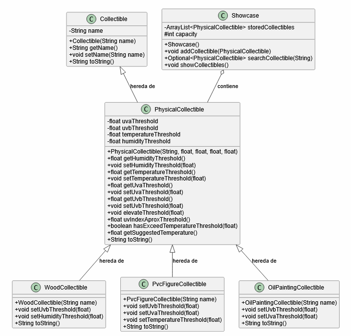
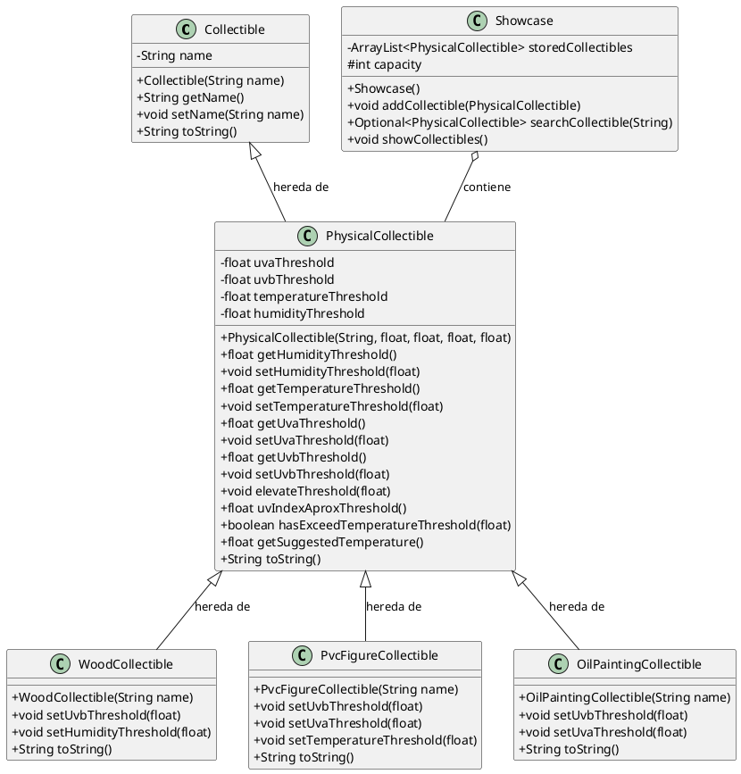

# Practica 4

## Diagrama

## Justificación

Es este caso, la forma de manejar el material y tipo de coleccionable era muy limitante, creando la clase `Collectible`
que tuviera la estructura básica y luego la clase hija `PhysicalCollectible`, se abre la puerta a guardar coleccionables
no tangibles (e.g. Un NFT of arte digital). Una vez teniendo la clase `PhysicalCollectible`, tenía sentido crear clases
hijas que tengan restricciones y valores predeterminados lógicos (en este caso no tienen sentido del todo, pero es un
ejemplo), pero sin necesidad de agregar restricciones repetidas o innecesarias.
